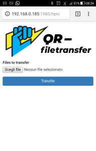

# qr-filetransfer


Transfer files over Wi-Fi from your computer to a mobile device by scanning a QR code without leaving the terminal.

**Desktop to mobile:**


**Mobile to desktop:**



## Install

Go 1.8 is required to run.

```
go get github.com/claudiodangelis/qr-filetransfer
```

### Installation through a package manager

[AUR (Arch Linux)](https://aur.archlinux.org/packages/qr-filetransfer-git/)

## How does it work?


`qr-filetransfer` binds a web server to the address of your Wi-Fi network interface on a random port and creates a handler for it. The default handler serves the content and exits the program when the transfer is complete.

The tool prints a QR code that encodes the text:

```
http://{address}:{port}/{random_path}
```


Most QR apps can detect URLs in decoded text and act accordingly (i.e. open the decoded URL with the default browser), so when the QR code is scanned the content will begin downloading by the mobile browser.

## Usage


**Note**: Both the computer and device must be on the same Wi-Fi network.

On the first run, `qr-filetransfer` will ask to choose which **network interface** to use to transfer the files. Choose the network interface connected to your Wi-Fi:

```
$ qr-filetransfer /tmp/file
Choose the network interface to use (type the number):
[0] enp3s0
[1] wlp0s20u10
```

_Note: On Linux it usually starts with `wl`._


The chosen network will be saved and no more setup is necessary, unless the `-force` argument is passed, or the `.qr-filetransfer.json` file the program stores in the home directory of the current user is deleted.


---

Two transfers mode are supported: **desktop-to-mobile** and **mobile-to-desktop**


## Desktop to Mobile

Transfer a single file

```
qr-filetransfer /path/to/file.txt
```

Zip the file, then transfer it

```
qr-filetransfer -zip /path/to/file.txt
```

Transfer a full directory. Note: the **directory is zipped** by the program before being transferred

```
qr-filetransfer /path/to/directory
```

## Mobile to Desktop

If you want to use it the other way, you need to pass the `-receive` flag. 

The first argument is the directory you want to transfer mobile files to.

```
qr-filetransfer -receive ~/Downloads
```

Specify the port to use for the web server

```
qr-filetransfer -port=8080 /path/to/my-file
```

**Note:** if the `-port` argument is passed, the value is stored and used for all future transfers. Use `-force` to reset the stored port value.


## Arguments

- `-debug` increases verbosity
- `-quiet` ignores non critical output
- `-force` ignores saved configuration
- `-zip` zips the content before transferring it
- `-port` sets port to bind the server to
- `-receive` enables transfers from mobile to desktop


## Authors

**qr-filetransfer** started from an idea of [Claudio d'Angelis](claudiodangelis@gmail.com) ([@daw985](https://twitter.com/daw985) on Twitter), the current maintainer, and it's [developed by the community](https://github.com/claudiodangelis/qr-filetransfer/graphs/contributors).


[Join us!](https://github.com/claudiodangelis/qr-filetransfer/fork)

## Logo Credits

Logo is provided by [@arasatasaygin](https://github.com/arasatasaygin) as part of the [openlogos](https://github.com/arasatasaygin/openlogos) initiative, a collection of free logos for open source projects.

Check out the rules to claim one: [rules of openlogos](https://github.com/arasatasaygin/openlogos#rules).

## Clones and Similar Projects

- [instant-file-transfer](https://github.com/maximumdata/instant-file-transfer) _(Uncredited)_ - Node.js project similar to this
- [qr-filetransfer](https://github.com/sdushantha/qr-filetransfer) - Python clone of this project
- [qr-filetransfer](https://github.com/svenkatreddy/qr-filetransfer) - Another Node.js clone of this project
- [qr-transfer-node](https://github.com/codezoned/qr-transfer-node) - Another Node.js clone of this project
- [QRDELIVER](https://github.com/realdennis/qrdeliver) - Node.js project similar to this
- [qrfile](https://github.com/sgbj/qrfile) - Transfer files by scanning a QR code
- [quick-transfer](https://github.com/CodeMan99/quick-transfer) - Node.js clone of this project
- [share-file-qr](https://github.com/pwalch/share-file-qr) - Python re-implementation of this project
- [share-files](https://github.com/antoaravinth/share-files) _(Uncredited)_  - Yet another Node.js clone of this project

## License

MIT. See [LICENSE](LICENSE).
